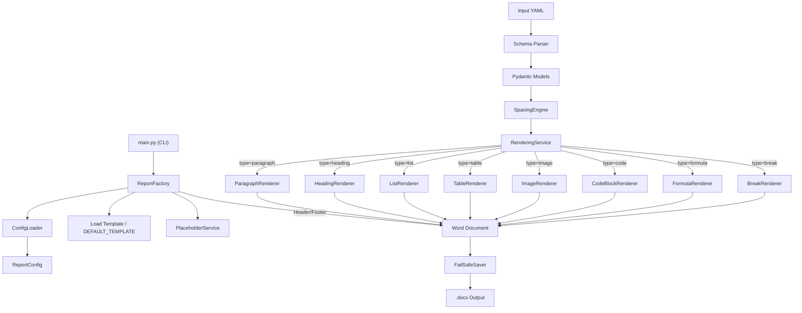

# System Architecture

## Overview
The `reports-formater` project uses a modular, extensible architecture based on **Service-Oriented** and **Strategy** patterns. Content from YAML is validated, processed by a spacing engine, and dispatched to specialized renderers that produce the final `.docx` output.

## Core Concepts

### 0. CLI Entry Point (`src/main.py`)
The command-line interface. Parses arguments, loads YAML, and delegates to `ReportFactory`.
```
python -m src.main input.yaml --template template.docx --output report.docx
```
Flags: `--config` (custom JSON), `-v` (verbose/debug logging).

### 1. Report Factory (`ReportFactory`)
The entry point and orchestrator. It is responsible for:
- Loading configuration (`report_styles.json` + YAML overrides).
- Loading the base usage template (`.docx`).
- Initializing services.
- Managing the high-level build process (Metadata -> Content -> Header/Footer -> Save).
- Configuring page layout (margins, header/footer distances from `page_setup`).
- Rendering header/footer with text and/or page numbers using `header_footer` style.

### 2. Rendering Service (`RenderingService`)
The heart of the content generation. It acts as a **Registry** and **Dispatcher**.
- **Registry:** specific renderers register themselves with the service (e.g., `ParagraphRenderer`, `TableRenderer`).
- **Dispatch:** When the service encounters a content node (e.g., `type: table`), it delegates processing to the appropriate renderer.

### 3. Renderers & Base Abstractions (`src/renderers/base.py`)
Each content type has a dedicated renderer class inheriting from `BaseRenderer`.
- **`BaseRenderer`** — Abstract class. Subclasses implement `node_type` (str) and `render(context, data)`.
- **`RenderContext`** — Dataclass carrying state through the render tree: `doc`, `container`, `config`, `style_manager`, `resource_path`, `dispatch`. The `container` changes during recursion (document → cell → header).
- **`ContentContainer`** — Protocol abstracting the write target (Document body, Table cell, Header/Footer).
- **Single Responsibility:** A renderer knows *only* how to draw its specific element.
- **Extensible:** Adding a new feature (e.g., "Chart") only requires creating `ChartRenderer` and registering it.

**Available renderers:**
| Renderer | Node Type | Description |
|---|---|---|
| `ParagraphRenderer` | `paragraph` | Text with inline formatting (`**bold**`, `*italic*`, `` `code` ``) |
| `HeadingRenderer` | `heading` | Headings with Word styles for TOC support |
| `ListRenderer` | `list` | Bullet, numbered, `alpha_cyrillic`, `alpha_latin` lists |
| `TableRenderer` | `table` | Grid tables with header row repetition |
| `ImageRenderer` | `image` | Images with alignment and captions |
| `CodeBlockRenderer` | `code` | Monospace code blocks with optional caption in repeating header |
| `FormulaRenderer` | `formula` | LaTeX formulas (matplotlib + system LaTeX fallback) |
| `BreakRenderer` | `break` | Page breaks, line breaks, section breaks |

### 4. Spacing Engine (`SpacingEngine`)
Middleware that automatically injects valid DSTU 3008-2015 spacing (like inserting `BreakNode` elements) between content elements like Headings, Images, and Code Listings.

### 5. Configuration Architecture
- **`src/config/models.py`** — Pydantic models (`ReportConfig`, `StylesConfig`, `FontConfig`, `StyleConfig`). Each style can define its own `font_name`.
- **`src/config/loader.py`** — Loads and merges `report_styles.json` with YAML overrides.
- **`src/config/schemas.py`** — Pydantic validation schemas for YAML content nodes.

**Configuration Hierarchy (Priority):**
```
models.py defaults (fallback) < report_styles.json (base) < YAML overrides (highest)
```

### 6. Utilities
- **`src/utils/docx_utils.py`** — OXML manipulation helpers: borders, invisible tables, `get_alignment_enum()` (single source of truth for alignment resolution).
- **`src/utils/formatting.py`** — Inline markdown parser (`**bold**`, `*italic*`, `` `code` ``).
- **`src/utils/file_io.py`** — `FailSafeSaver` for robust file writing with retry on permission errors.

### 7. Styles & Abstraction
- **StyleManager:** Abstracts the complexity of Word styles. It performs fuzzy matching to find "Heading 1" even if the template calls it "heading1".

### 8. Default Template
- **`src/DEFAULT_TEMPLATE.docx`** — A minimal `.docx` file used as fallback when no user template is provided. Its purpose is to supply base Word styles (Normal, Heading 1, etc.) so that `StyleManager` can resolve them. It does NOT contain any visible content.

## Data Flow



## Detailed Components

| Component | Responsibility |
|-----------|----------------|
| `src/report_factory.py` | High-level orchestration, header/footer rendering, page layout. |
| `src/services/rendering_service.py` | Dispatching nodes to renderers. |
| `src/services/spacing_engine.py` | Injecting empty break lines automatically between nodes per DSTU 3008-2015. |
| `src/services/style_manager.py` | Resolving Word style names robustly (fuzzy matching). |
| `src/services/placeholder_service.py` | Replacing `{{KEY}}` placeholders in templates. |
| `src/renderers/*` | Individual logic for drawing elements. |
| `src/config/models.py` | Pydantic models for type-safe configuration (`ReportConfig`, `StyleConfig`). |
| `src/config/loader.py` | Loading and merging JSON config with YAML overrides. |
| `src/config/schemas.py` | Data validation schemas for YAML content nodes. |
| `src/utils/docx_utils.py` | OXML helpers: borders, alignment (`get_alignment_enum`), table optimization. |
| `src/utils/formatting.py` | Inline markdown parsing for runs. |
| `src/utils/file_io.py` | Fail-safe file saving with retry. |

## Design Principles
1.  **Isolation:** A bug in table rendering should not break paragraph rendering.
2.  **Type Safety:** We use Python type hints and Pydantic everywhere.
3.  **Fail-Safe:** File IO operations retry automatically on permission errors.
4.  **Single Source of Truth:** Alignment handled by `get_alignment_enum()`, fonts resolved via `style_config.font_name or config.fonts.default_name`.
