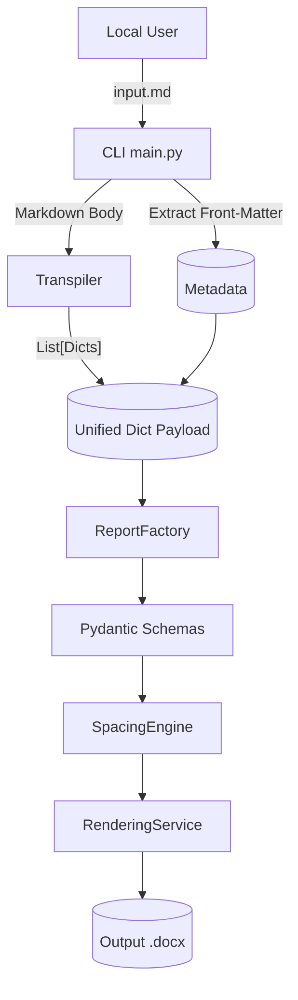

# System Architecture

## 1. System Overview
The `reports-formater` project has evolved from a simple YAML-to-DOCX script into a robust **Stateful Dual-Protocol Gateway**. It is designed to automatically generate academic technical reports that strictly adhere to DSTU 3008-2015 standards.

The system accepts input in two formats (**Structured YAML** or **Natural Markdown**) through two communication channels (**Local CLI** or **Model Context Protocol (MCP)** for AI agents), ultimately unifying the data into a single strict Abstract Syntax Tree (AST) compiled by a "Dumb Builder" rendering backend.

---

## 2. The 4-Layer Architecture

The system is strictly segregated into four decoupled layers. Lower layers have absolutely no knowledge of the layers above them.

### Layer 4: Interface & Transport (Entry Points)
Handles external requests, standard IO, and routing.
- **`src/main.py`**: The legacy and modern CLI interface. Detects file extensions (`.yaml` vs `.md`) and routes to the appropriate parser.
- **`src/mcp_server_yaml.py`**: Stdio-based JSON-RPC server exposing tools for LLMs to generate reports via structured YAML chunks.
- **`src/mcp_server_markdown.py`**: Stdio-based JSON-RPC server exposing tools for LLMs to generate reports via natural Pandoc-style Markdown chunks.

### Layer 3: Transpiler Bridge
A pure string-processing layer that acts as an adapter for natural Markdown text.
- **`src/sdk/markdown_parser.py`**: Uses zero external dependencies (only `re`). It parses Markdown into raw dictionary nodes compatible with our AST.
- **Smart Features:** Implements *Smart Defaults* (automatically applying `align: justify`, `fit_to_page: true`) and *Smart Caption Absorption* (consuming preceding paragraphs as captions for tables and code blocks) to relieve LLMs from formatting burdens.

### Layer 2: Stateful Session & Validation
Manages in-memory document accumulation and safeguards system integrity during interactive AI generation.
- **`src/config/schemas.py`**: Strict Pydantic V2 models defining the allowed document AST.
- **`src/sdk/session.py` (`ReportSession`)**: Maintains `self.nodes` in memory.
- **Atomic Transactions**: Validates chunks using an "All-or-Nothing" approach. If a single node fails Pydantic validation or triggers a `FileNotFoundError`, the entire chunk is rejected, preventing AST corruption.
- **Crash Recovery**: Automatically writes session state to `draft_report.yaml` after every successful transaction.

### Layer 1: Stateless Core Engine
The legacy rendering engine. It knows nothing about MCP, sessions, or Markdown. It only understands validated Python objects.
- **`src/report_factory.py`**: Orchestrates document assembly, configures page margins, headers/footers, and invokes services.
- **`src/services/spacing_engine.py`**: Middleware that injects explicit DSTU-compliant line breaks between nodes (Margin Collapsing).
- **`src/services/rendering_service.py`**: Dispatches nodes to specific visual renderers based on the Strategy pattern.

---

## 3. Execution Modes & Data Flow

The system operates in two distinct execution modes depending on the interface used.

### Mode A: Stateful MCP Workflow (AI Agents)
Used by Cursor, Claude Desktop, or Aider. The document is built sequentially in chunks. `ReportSession` (Layer 2) is heavily utilized.

```mermaid
graph TD
    Client[AI Agent] -- JSON-RPC --> L4[MCP Server]
    L4 -- "submit_markdown_chunk()" --> L3[Transpiler]
    L3 -- "Raw Dicts" --> L2[ReportSession]
    
    sublayer2[Layer 2 Validation]
    L2 --> Validator[Pydantic Schemas]
    Validator -- "Invalid" --> Err[JSON Error Diagnostic]
    Err --> Client
    Validator -- "Valid" --> AST[(In-Memory AST)]
    AST --> Backup[(draft_report.yaml)]
    end
    
    Client -- "finalize_report()" --> L4
    L4 --> L2
    AST -- "Serialize" --> L1[ReportFactory]
    L1 --> SE[SpacingEngine]
    SE --> RS[RenderingService]
    RS --> Word[(Output .docx)]
```

### Mode B: Stateless CLI Workflow (Local Users)
Used via `python -m src.main`. This workflow is instantaneous and **bypasses Layer 2 (`ReportSession`) entirely** because the entire document is provided upfront.

```mermaid
graph TD
    User[Local User] -- "input.md" --> L4[CLI main.py]
    L4 -- "Extract Front-Matter" --> Meta[(Metadata)]
    L4 -- "Markdown Body" --> L3[Transpiler]
    L3 -- "List[Dicts]" --> AST[(Unified Dict Payload)]
    Meta --> AST
    
    AST --> L1[ReportFactory]
    L1 --> Validator[Pydantic Schemas]
    Validator --> SE[SpacingEngine]
    SE --> RS[RenderingService]
    RS --> Word[(Output .docx)]
```

---

## 4. Configuration & Styling Hierarchy

Visual styling is entirely abstracted away from the code. The system uses a strict priority-based cascading configuration:

| Priority | Source | Description |
|---|---|---|
| **1 (Lowest)** | `src/config/models.py` | Hardcoded Pydantic defaults (fallback if JSON is missing). |
| **2** | `src/report_styles.json` | The core visual identity. Defines fonts, line spacing, margins, and indents per node style. |
| **3 (Highest)** | `metadata` / Front-Matter | Runtime YAML overrides (e.g., `page_numbering`, `header_text`). |

*Note on Templates:* The base `.docx` template (`--template`) provides the physical XML foundation and title page layout. The code applies margin and font overrides on top of it.

---

## 5. Core Design Principles

1. **The "Dumb Builder" (Composition over Complexity):** Renderers are the "hands", not the "brains". They do not guess semantics or analyze text. If `align` is not specified, they fall back to the config default. They just draw.
2. **Zero-Trust Validation:** Never trust LLM or user inputs. Validate every node through Pydantic before allowing it to mutate the state buffer.
3. **Smart Defaults (Layer 3 Isolation):** Any "guessing" or "syntactic sugar" (like assuming a paragraph before a table is its caption) happens strictly in the Markdown Transpiler. The Core Engine remains pure and deterministic.
4. **Do Not Break Userspace:** The system must always maintain backward compatibility. Monolithic YAML files written years ago must still compile perfectly today via the CLI.

---

## 6. Component Registry

| Component | Responsibility / Notes |
|-----------|-------------------------|
| `src/config/loader.py` | Deep merges JSON configs and normalizes YAML shorthand properties. |
| `src/config/schemas.py` | Single source of truth for allowed AST structures. |
| `src/renderers/*` | Isolated drawing logic. E.g., `image_renderer.py` handles LibreOffice bug fixes for inline shapes. |
| `src/services/placeholder_service.py` | Uses a **Cascade Strategy** to replace `{{KEY}}` tags in templates (first trying run-level to preserve formatting, falling back to paragraph-level). |
| `src/services/style_manager.py` | Uses fuzzy matching to robustly map abstract style names (e.g., "heading1") to internal MS Word XML style IDs. |
| `src/utils/docx_utils.py` | OXML manipulation helpers. Creates invisible borderless tables to anchor images and formulas side-by-side with captions. |
| `src/utils/file_io.py` | `FailSafeSaver` implements automatic retry and timestamped renaming if the target `.docx` is locked by another program. |