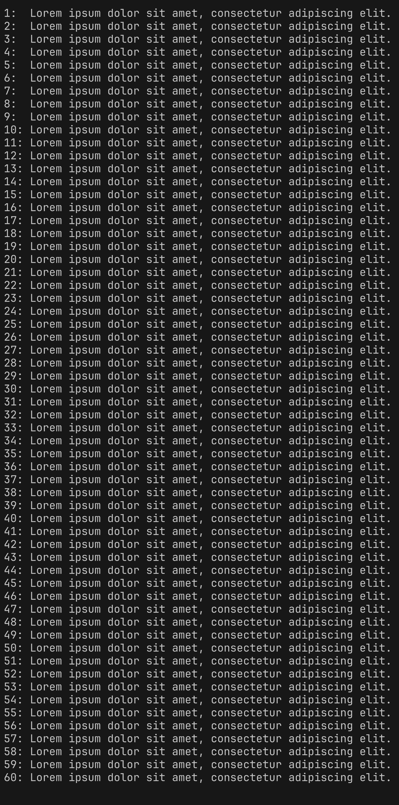

# TEST 1: HEADING LEVEL 1

This section tests heading rendering.

## 1.1 Heading Level 2

This section tests heading rendering.

# TEST 2: PARAGRAPHS

This is a standard paragraph with default formatting. It should have proper margins, line spacing, and first-line indent according to report_styles.json.

## 2.1 Inline Formatting

Testing **BOLD text** - these words should appear bold.

Testing *ITALIC text* - these words should appear italic.

Testing `INLINE CODE` - these words should appear in monospace font (Consolas).

Testing **mixed** formatting: *italic*, `code`, and **bold** in one paragraph.

# TEST 3: LISTS

## 3.1 Bullet List

The following should display as a bulleted list with dash (–) prefix:

- First bullet item
- Second bullet item with **bold** text
- Third bullet item with `inline code`

## 3.2 Numbered List

The following should display as 1. 2. 3. numbered list:

1. First numbered item
2. Second numbered item
3. Third numbered item
4. Fourth numbered item

## 3.3 Cyrillic Alpha List

The following should display with Cyrillic letters а) б) в) etc.:

а) Alpha item a)
б) Alpha item b)
в) Alpha item c)<br>Second paragraph inside alpha item c)

## 3.4 Latin Alpha List

The following should display with Latin letters a. b. c. etc.:

a. Latin item a.
b. Latin item b.
c. Latin item c.

# TEST 4: TABLES

Таблиця 1 — Simple test table (first row should repeat on page break):
| Column A | Column B | Column C |
|----------|----------|----------|
| Row 1 Cell 1<br>Line 2 | Row 1 Cell 2 | Row 1 Cell 3 |
| Row 2 Cell 1 | Row 2 **Bold** | Row 2 `Code` |
| Row 3 Cell 1 | Row 3 Cell 2 | Row 3 Cell 3 |

# TEST 5: CODE BLOCKS

The following should display as monospace code block:

Лістинг 1 — Python function example
```python
def test_function(arg1, arg2):
    """Test docstring."""
    result = arg1 + arg2
    print(f"Result: {result}")
    return result
```

Лістинг 2 — QuickSort (C language)
```c
#include <stdio.h>

void swap(int* a, int* b) {
    int t = *a;
    *a = *b;
    *b = t;
}

int partition(int arr[], int low, int high) {
    int pivot = arr[high];
    int i = (low - 1);

    for (int j = low; j <= high - 1; j++) {
        if (arr[j] < pivot) {
            i++;
            swap(&arr[i], &arr[j]);
        }
    }
    swap(&arr[i + 1], &arr[high]);
    return (i + 1);
}

void quickSort(int arr[], int low, int high) {
    if (low < high) {
        int pi = partition(arr, low, high);
        quickSort(arr, low, pi - 1);
        quickSort(arr, pi + 1, high);
    }
}

void printArray(int arr[], int size) {
    for (int i = 0; i < size; i++)
        printf("%d ", arr[i]);
    printf("\n");
}

int main() {
    int arr[] = {10, 7, 8, 9, 1, 5};
    int n = sizeof(arr) / sizeof(arr[0]);
    quickSort(arr, 0, n - 1);
    printf("Sorted array: \n");
    printArray(arr, n);
    return 0;
}
```

Лістинг 3 — Native File Embedding (Relative Path) (sample_code.cs)
```csharp
```

# TEST 6: IMAGES

The following should display an image centered with caption below:




<br>

## Formula Test

Here is a simple formula rendered via matplotlib:

$$E = mc^2$$ (1.1)

And a more complex one:

$$x = \frac{-b \pm \sqrt{b^2 - 4ac}}{2a}$$ (1.2)

Simle system-formula:

$$f(x) = \begin{cases} x^2, & \text{if } x < 0 \\ \ln(x), & \text{if } x \ge 0 \end{cases}$$ (1.2)

Heavy Math (Maxwell's Equations - Differential Form):

$$\begin{cases} \nabla \cdot \mathbf{E} &= \frac{\rho}{\varepsilon_0} \\ \nabla \cdot \mathbf{B} &= 0 \\ \nabla \times \mathbf{E} &= -\frac{\partial \mathbf{B}}{\partial t} \\ \nabla \times \mathbf{B} &= \mu_0\mathbf{J} + \mu_0\varepsilon_0\frac{\partial \mathbf{E}}{\partial t} \end{cases}$$ (1.3)

# TEST 8: MULTI-PARAGRAPH SUPPORT

This paragraph node contains a newline.<br>This should be rendered as a SEPARATE paragraph in Word, with its own spacing and indents.

Testing triple newlines:<br><br><br>This should result in two empty paragraphs between these lines.

# Додаток А. Фрагменти вихідного коду

Цей розділ є Додатком. Він починається з нової сторінки (нової секції) і має особливі колонтитули.

Лістинг А.1 — Додатковий скрипт
```python
def helper():
    return "This is appendix A"
```

# Додаток Б - Додаткові таблиці

Таблиця Б.1 — Тестова таблиця додатка
| Параметр | Значення |
|----------|----------|
| Статус   | Успішно  |

# TEST SUMMARY

If you can read this document correctly with all elements above visible, the test has PASSED. Check each section visually to confirm proper formatting.
